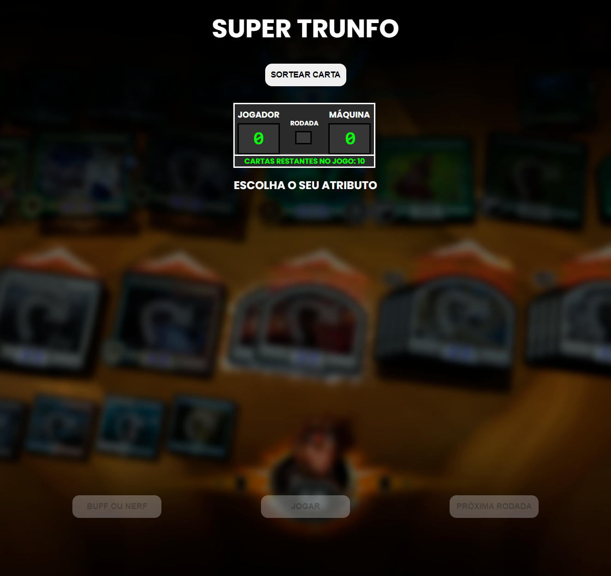
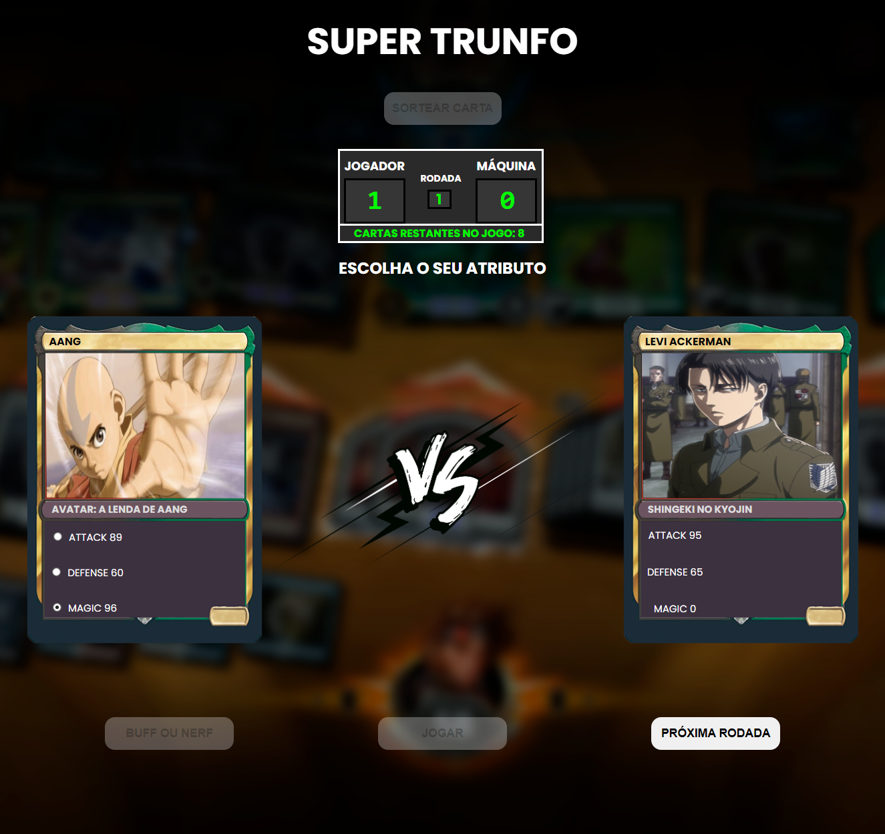

<h1 align="center">Game Super Trunfo</h1>

## 💻 Sobre o projeto:
Esse projeto foi desenvolvido com base no conhecimento adquirido durante a imersão dev da alura e de ideias projetadas por mim.
 
O objetivo do projeto era criar um jogo no estilo super trunfo, com cards de vários temas, onde o player enfrenta a máquina comparando os pontos de habilidades de suas cartas sorteadas, até o fim da quantidade de cartas.
  

## 🖌️ Layout:
 

 

  

## 🛠 Tecnologias:

As seguintes tecnologias foram usadas no desenvolvimento do projeto:

  
  
  

 

## 💡 Como acessar o projeto:
#### Para acessar basta clicar no link a seguir:
<!-- <i>Durante o teste do projeto, é possível ativar e desativar a música de fundo.</i>-->
  

## 📝 Autora:
⚡ Emmanuelly Lavínia da Silva

